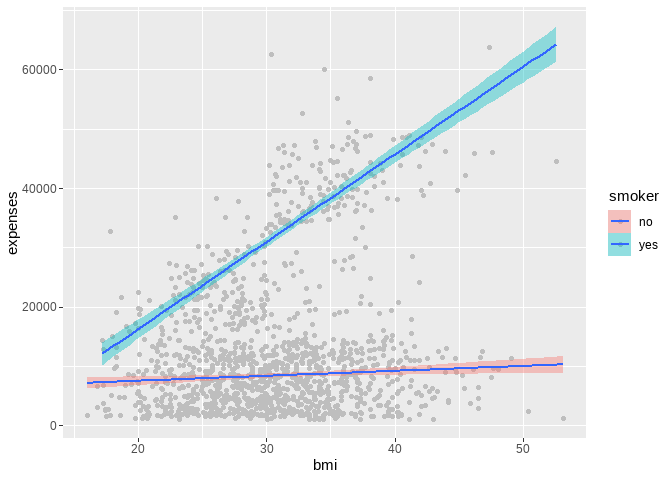
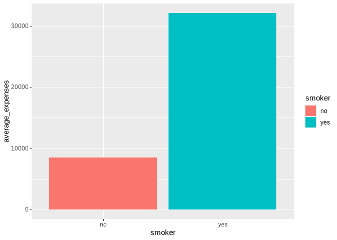
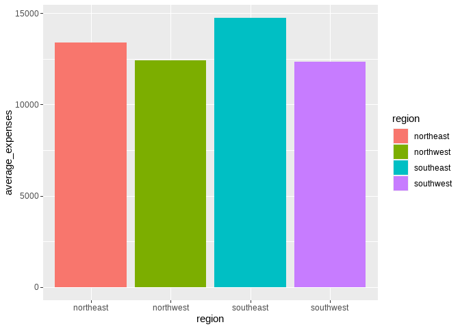
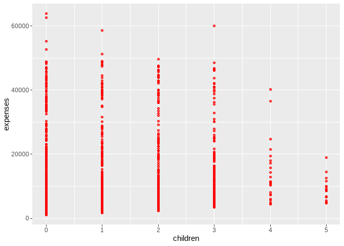
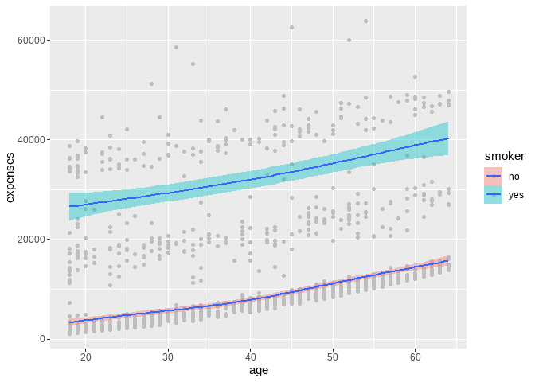
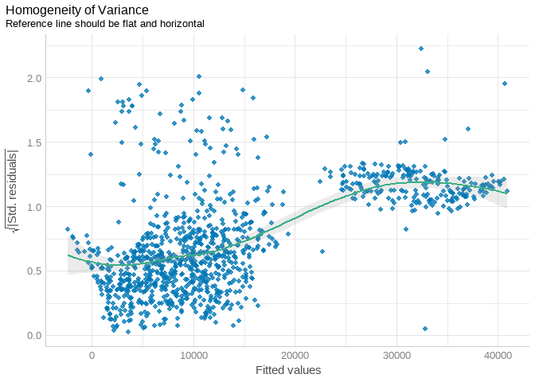
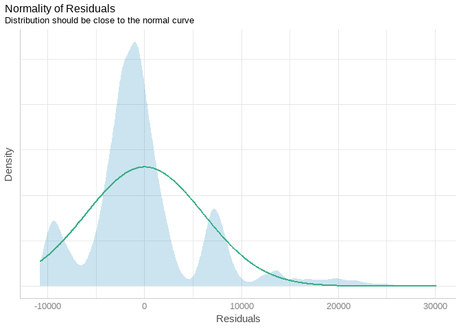
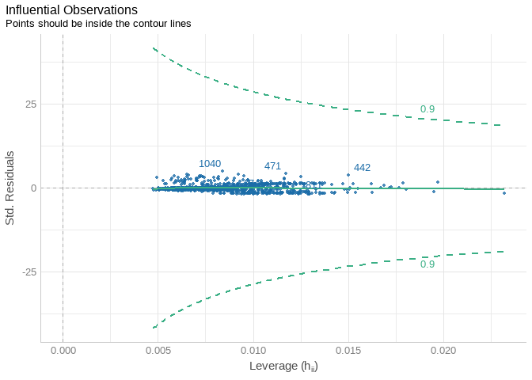

Insurance expenses prediction
================
francis kyalo
2023-01-18

\#INSURANCE EXPENSES PREDICTION

\###Problem statement:

According to the International Monetary Fund (IMF) working paper titled
“Insurance Premiums: Determinants and Policy Implications,” there are
several challenges that insurance companies face when determining
insurance premiums. Insurance companies must assess the risk of an
insurance event occurring for each policyholder, taking into account a
wide range of factors such as the policyholder’s age, gender, medical
history, and the type and cost of coverage. This can be a complex and
time-consuming process.

Adverse selection is considered one of the major risks facing the
insurance sector. This is where an applicant gains insurance at a

cost that is below their true level of risk due to important variables
not being taken into consideration while computing the premiums.

\###Main Objective:

The goal of this project is to build a predictive model that can
accurately (more than 85% accuracy)estimate insurance premiums based on
a variety of input features.

\###Metric for Success: The project will be considered a success if the
predictive model is able to explain not less than 80% of the variation
of the target variable and have a Mean Absolute Percentage Error (MAPE)
of not more than 10%.

\###Data Understanding The data set to be used from Kaggle comprises of
1338 rows and 7 columns. This includes 4 numerical and 3 cotegorical
features which will be useful in selecting the target and predictor
variables in this analysis.

1.  age - This is the age of an individual in years
2.  bmi - This is the body mass index of an individual
3.  children - This indicates the number of dependents covered by the
    health insurance
4.  smoker - This describes whether an individual is a smoker or
    non-smoker (yes=smoker and no=non-smoker)
5.  region - This describes the beneficiary’s residential area in the
    USA
6.  expenses - This is the individual’s medical costs billed by health
    insurance

``` r
# importing important libraries

library(tidyverse)
```

    ## Warning: package 'tidyverse' was built under R version 4.1.3

    ## -- Attaching packages --------------------------------------- tidyverse 1.3.1 --

    ## v ggplot2 3.4.0     v purrr   0.3.4
    ## v tibble  3.1.5     v dplyr   1.0.7
    ## v tidyr   1.1.4     v stringr 1.4.0
    ## v readr   2.1.2     v forcats 0.5.1

    ## Warning: package 'ggplot2' was built under R version 4.1.3

    ## Warning: package 'readr' was built under R version 4.1.3

    ## -- Conflicts ------------------------------------------ tidyverse_conflicts() --
    ## x dplyr::filter() masks stats::filter()
    ## x dplyr::lag()    masks stats::lag()

``` r
library(janitor)
```

    ## Warning: package 'janitor' was built under R version 4.1.3

    ## 
    ## Attaching package: 'janitor'

    ## The following objects are masked from 'package:stats':
    ## 
    ##     chisq.test, fisher.test

``` r
library(dlookr)
```

    ## Warning: package 'dlookr' was built under R version 4.1.3

    ## 
    ## Attaching package: 'dlookr'

    ## The following object is masked from 'package:tidyr':
    ## 
    ##     extract

    ## The following object is masked from 'package:base':
    ## 
    ##     transform

``` r
library(performance)
```

    ## Warning: package 'performance' was built under R version 4.1.3

``` r
library(flextable)
```

    ## Warning: package 'flextable' was built under R version 4.1.3

    ## 
    ## Attaching package: 'flextable'

    ## The following object is masked from 'package:purrr':
    ## 
    ##     compose

``` r
library(MLmetrics)
```

    ## Warning: package 'MLmetrics' was built under R version 4.1.3

    ## 
    ## Attaching package: 'MLmetrics'

    ## The following object is masked from 'package:base':
    ## 
    ##     Recall

``` r
library(caret)
```

    ## Loading required package: lattice

    ## 
    ## Attaching package: 'caret'

    ## The following objects are masked from 'package:MLmetrics':
    ## 
    ##     MAE, RMSE

    ## The following object is masked from 'package:purrr':
    ## 
    ##     lift

``` r
df <- read_csv("~/R projects/insurance expenses ML/Insurances-expenses-Prediction-in-R/Insurancedata.csv")
```

    ## Rows: 1338 Columns: 7
    ## -- Column specification --------------------------------------------------------
    ## Delimiter: ","
    ## chr (3): sex, smoker, region
    ## dbl (4): age, bmi, children, expenses
    ## 
    ## i Use `spec()` to retrieve the full column specification for this data.
    ## i Specify the column types or set `show_col_types = FALSE` to quiet this message.

# EXPLORATORY DATA ANALYSIS AND DATA CLEANING

``` r
# check for any missing values 
df %>% duplicated() %>% sum()
```

    ## [1] 1

``` r
# removing the duplicated row 
df <- df %>% distinct()
```

``` r
# getting a feel of the data and check if they are any missing values

df %>% describe()
```

    ## # A tibble: 4 x 26
    ##   described_variables     n    na   mean     sd se_mean    IQR skewness kurtosis
    ##   <chr>               <int> <int>  <dbl>  <dbl>   <dbl>  <dbl>    <dbl>    <dbl>
    ## 1 age                  1337     0 3.92e1 1.40e1 3.84e-1 2.4 e1   0.0548  -1.24  
    ## 2 bmi                  1337     0 3.07e1 6.10e0 1.67e-1 8.4 e0   0.284   -0.0556
    ## 3 children             1337     0 1.10e0 1.21e0 3.30e-2 2   e0   0.937    0.201 
    ## 4 expenses             1337     0 1.33e4 1.21e4 3.31e+2 1.19e4   1.52     1.60  
    ## # ... with 17 more variables: p00 <dbl>, p01 <dbl>, p05 <dbl>, p10 <dbl>,
    ## #   p20 <dbl>, p25 <dbl>, p30 <dbl>, p40 <dbl>, p50 <dbl>, p60 <dbl>,
    ## #   p70 <dbl>, p75 <dbl>, p80 <dbl>, p90 <dbl>, p95 <dbl>, p99 <dbl>,
    ## #   p100 <dbl>

``` r
df %>% diagnose_category()
```

    ## # A tibble: 8 x 6
    ##   variables levels        N  freq ratio  rank
    ##   <chr>     <chr>     <int> <int> <dbl> <int>
    ## 1 sex       male       1337   675  50.5     1
    ## 2 sex       female     1337   662  49.5     2
    ## 3 smoker    no         1337  1063  79.5     1
    ## 4 smoker    yes        1337   274  20.5     2
    ## 5 region    southeast  1337   364  27.2     1
    ## 6 region    southwest  1337   325  24.3     2
    ## 7 region    northeast  1337   324  24.2     3
    ## 8 region    northwest  1337   324  24.2     3

``` r
df %>% diagnose_numeric()
```

    ## # A tibble: 4 x 10
    ##   variables   min     Q1     mean median      Q3     max  zero minus outlier
    ##   <chr>     <dbl>  <dbl>    <dbl>  <dbl>   <dbl>   <dbl> <int> <int>   <int>
    ## 1 age         18    27      39.2    39      51      64       0     0       0
    ## 2 bmi         16    26.3    30.7    30.4    34.7    53.1     0     0       9
    ## 3 children     0     0       1.10    1       2       5     573     0       0
    ## 4 expenses  1122. 4746.  13279.   9386.  16658.  63770.      0     0     139

``` r
# check for outliers in our dataset
df %>% diagnose_outlier()
```

    ## # A tibble: 4 x 6
    ##   variables outliers_cnt outliers_ratio outliers_mean with_mean without_mean
    ##   <chr>            <int>          <dbl>         <dbl>     <dbl>        <dbl>
    ## 1 age                  0          0             NaN       39.2         39.2 
    ## 2 bmi                  9          0.673          49.3     30.7         30.5 
    ## 3 children             0          0             NaN        1.10         1.10
    ## 4 expenses           139         10.4         42104.   13279.        9935.

Although there is evidence of outliers, they don’t seem to have such a
great effect on the mean so they will be no need to remove them unless
they affect our regression model

``` r
df %>% head()
```

    ## # A tibble: 6 x 7
    ##     age sex      bmi children smoker region    expenses
    ##   <dbl> <chr>  <dbl>    <dbl> <chr>  <chr>        <dbl>
    ## 1    19 female  27.9        0 yes    southwest   16885.
    ## 2    18 male    33.8        1 no     southeast    1726.
    ## 3    28 male    33          3 no     southeast    4449.
    ## 4    33 male    22.7        0 no     northwest   21984.
    ## 5    32 male    28.9        0 no     northwest    3867.
    ## 6    31 female  25.7        0 no     southeast    3757.

``` r
ggplot(df, aes(age))+
  geom_histogram(fill='blue', bins = 10)
```

<!-- -->

``` r
ggplot(df, aes(bmi))+
  geom_histogram(fill='yellow',bins = 10)
```

<!-- -->

``` r
ggplot(df, aes(expenses))+
  geom_histogram(fill='lightgreen', bins = 10)
```

<!-- -->

``` r
ggplot(df, aes(region, fill=region))+
  geom_bar()
```

<!-- -->
The graph above indicates the insurance premium means for each region.
Individuals in the Southeast region make a higher contribution of about
USD 14,500 while individuals in the Southwest region make contributions
of USD 12,000.

``` r
ggplot(df,aes(sex, fill=sex))+
  geom_bar()
```

<!-- -->
From the above barplot, it looks like both gender are well represented
in the dataset

``` r
ggplot(df, aes(age, expenses, fill=smoker))+
  geom_point(color='grey')+
  geom_smooth()
```

    ## `geom_smooth()` using method = 'gam' and formula = 'y ~ s(x, bs = "cs")'

<!-- -->
From the scatter plot above, it can be noted that the expenses billed to
both smokers and non-smokers increases as age increases. However, the
expenses on non-smokers are much lower than those of individuals who
smoke. The increament in expenses could be as a result of deteriorating
health with age plus the health risks associated with smoking.

``` r
ggplot(df, aes(bmi, expenses, fill=smoker))+
  geom_point(color='grey')+
  geom_smooth(method = 'lm')
```

    ## `geom_smooth()` using formula = 'y ~ x'

<!-- -->
The scatter plot above shows the relationship between BMI, smoker and
expenses . The plot shows that there is a positive relationship between
BMI and expenses, meaning that as BMI increases, expenses also increase.
Moreover, individuals with a high BMI who smoke incur the highest
expenses as shown above. This may also indicate that as the BMI
increases and an individual smokes, there is a higher risk of incurring
medical expenses, which would be in line with the insurance company’s
risk assessment process.

``` r
df %>% group_by(smoker) %>% summarise(average_expenses = mean(expenses)) %>% 
  ggplot(aes(smoker, average_expenses, fill=smoker))+
    geom_bar(stat = 'identity')
```

<!-- -->

``` r
df %>% group_by(region) %>% summarise(average_expenses = mean(expenses)) %>% 
  ggplot(aes(region, average_expenses, fill=region))+
    geom_bar(stat = 'identity')
```

<!-- -->

``` r
ggplot(df, aes(children, expenses))+
  geom_point(color='red', alpha=0.7)
```

<!-- -->

``` r
# checking collinearity

df %>% correlate() %>% flextable()
```

    ## PhantomJS not found. You can install it with webshot::install_phantomjs(). If it is installed, please make sure the phantomjs executable can be found via the PATH variable.

From the table above, correlations seem to within a reasonable level and
would not lead to multicollinearity problems

# MODELLING🤯

### First Model

First thing first, we are going to split the data into training and
testing sets

``` r
split <- createDataPartition(df$expenses, p=0.8, list = FALSE)

train_set <- df[split,]

test_set <- df[-split,]
```

``` r
first_model <- lm(expenses ~., data = train_set)
first_model %>% summary()
```

    ## 
    ## Call:
    ## lm(formula = expenses ~ ., data = train_set)
    ## 
    ## Residuals:
    ##    Min     1Q Median     3Q    Max 
    ## -10794  -2981  -1020   1407  30142 
    ## 
    ## Coefficients:
    ##                  Estimate Std. Error t value Pr(>|t|)    
    ## (Intercept)     -12281.80    1117.89 -10.987  < 2e-16 ***
    ## age                258.90      13.41  19.310  < 2e-16 ***
    ## sexmale             90.04     374.90   0.240  0.81025    
    ## bmi                351.34      32.29  10.879  < 2e-16 ***
    ## children           468.88     154.60   3.033  0.00248 ** 
    ## smokeryes        23473.90     464.50  50.536  < 2e-16 ***
    ## regionnorthwest   -700.18     531.29  -1.318  0.18782    
    ## regionsoutheast  -1162.95     544.62  -2.135  0.03296 *  
    ## regionsouthwest  -1286.40     542.15  -2.373  0.01783 *  
    ## ---
    ## Signif. codes:  0 '***' 0.001 '**' 0.01 '*' 0.05 '.' 0.1 ' ' 1
    ## 
    ## Residual standard error: 6107 on 1063 degrees of freedom
    ## Multiple R-squared:  0.7482, Adjusted R-squared:  0.7463 
    ## F-statistic: 394.8 on 8 and 1063 DF,  p-value: < 2.2e-16

### Model diagnostics

``` r
first_model %>% check_heteroscedasticity() %>% plot()
```

<!-- -->

``` r
# checking for normality of residuals
first_model %>% check_normality() %>% plot()
```

<!-- -->

``` r
first_model %>% check_collinearity()
```

    ## # Check for Multicollinearity
    ## 
    ## Low Correlation
    ## 
    ##      Term  VIF      VIF 95% CI Increased SE Tolerance Tolerance 95% CI
    ##       age 1.01 [1.00,    1.90]         1.01      0.99     [0.53, 1.00]
    ##       sex 1.01 [1.00,    5.60]         1.00      0.99     [0.18, 1.00]
    ##       bmi 1.12 [1.06,    1.22]         1.06      0.89     [0.82, 0.94]
    ##  children 1.00 [1.00, 7056.70]         1.00      1.00     [0.00, 1.00]
    ##    smoker 1.01 [1.00,    1.91]         1.01      0.99     [0.52, 1.00]
    ##    region 1.12 [1.07,    1.22]         1.06      0.89     [0.82, 0.94]

``` r
first_model %>% check_outliers() %>% plot()
```

<!-- -->

``` r
# Accuracy of the model 
MAPE(y_pred = first_model$fitted.values, y_true = train_set$expenses)
```

    ## [1] 0.4222116

## Second Model🎅

In this model we will log transform the target and include interaction
terms between age and smoker and BMI and smoker

``` r
train_set2 <- train_set%>% mutate(log_exp = log(expenses)) %>% select(-expenses)

train_set2 %>% head()
```

    ## # A tibble: 6 x 7
    ##     age sex      bmi children smoker region    log_exp
    ##   <dbl> <chr>  <dbl>    <dbl> <chr>  <chr>       <dbl>
    ## 1    19 female  27.9        0 yes    southwest    9.73
    ## 2    18 male    33.8        1 no     southeast    7.45
    ## 3    28 male    33          3 no     southeast    8.40
    ## 4    33 male    22.7        0 no     northwest   10.0 
    ## 5    32 male    28.9        0 no     northwest    8.26
    ## 6    31 female  25.7        0 no     southeast    8.23

``` r
second_model <- lm(log_exp ~ age + sex + bmi + 
                     children +
                     smoker + 
                     region +
                     age * smoker +
                     bmi * smoker, data = train_set2)

second_model %>% summary()
```

    ## 
    ## Call:
    ## lm(formula = log_exp ~ age + sex + bmi + children + smoker + 
    ##     region + age * smoker + bmi * smoker, data = train_set2)
    ## 
    ## Residuals:
    ##      Min       1Q   Median       3Q      Max 
    ## -0.68609 -0.15073 -0.06495 -0.01104  2.32012 
    ## 
    ## Coefficients:
    ##                   Estimate Std. Error t value Pr(>|t|)    
    ## (Intercept)      7.1728102  0.0808015  88.771  < 2e-16 ***
    ## age              0.0409779  0.0009655  42.440  < 2e-16 ***
    ## sexmale         -0.0731356  0.0241173  -3.032  0.00248 ** 
    ## bmi              0.0009627  0.0023509   0.410  0.68226    
    ## children         0.1055825  0.0099330  10.630  < 2e-16 ***
    ## smokeryes        1.2791254  0.1608858   7.951 4.73e-15 ***
    ## regionnorthwest -0.0965427  0.0341497  -2.827  0.00479 ** 
    ## regionsoutheast -0.1488583  0.0350171  -4.251 2.32e-05 ***
    ## regionsouthwest -0.1631062  0.0348493  -4.680 3.23e-06 ***
    ## age:smokeryes   -0.0321057  0.0021471 -14.953  < 2e-16 ***
    ## bmi:smokeryes    0.0487832  0.0046186  10.562  < 2e-16 ***
    ## ---
    ## Signif. codes:  0 '***' 0.001 '**' 0.01 '*' 0.05 '.' 0.1 ' ' 1
    ## 
    ## Residual standard error: 0.3923 on 1061 degrees of freedom
    ## Multiple R-squared:  0.8181, Adjusted R-squared:  0.8164 
    ## F-statistic: 477.1 on 10 and 1061 DF,  p-value: < 2.2e-16

``` r
MAPE(y_pred = second_model$fitted.values, y_true = train_set2$log_exp)
```

    ## [1] 0.02305865

``` r
exp(0.0228614)
```

    ## [1] 1.023125

This shows that the second model is better than the first model as it
has more superior R-squared and Mean Absolute Percentage Error🚀

# Testing the performance of the model on new unseen data

``` r
test_set2 <- test_set%>% mutate(log_exp = log(expenses)) %>% select(-expenses)

y_test_pred = predict(second_model, newdata = test_set2)

MAPE(y_test_pred, test_set2$log_exp)
```

    ## [1] 0.02344518

According to the Mean Absolute Percentage Error, the ultimate model will
have an expected error of about 2.5 percent on every prediction it makes
which is pretty impressive

# Recommendations

1.The company should consider implementing a higher premium for smokers,
as the data indicates that they have a higher expected expense.

2.The company should also take into account the number of children when
setting premiums, as this variable had a positive correlation with
expenses.

3.The company can also consider offering discounted premiums for
policyholders from the SouthWest and Northwest regions, as they had
lower expected expenses compared to those from the SouthEast region.

4.The company should also consider collecting more data on other factors
such as medical conditions, previous claims, lifestyle, and occupation
to improve the accuracy of their pricing model.

5.The company can also consider offering discounts for individuals who
maintain a healthy BMI, as this variable was negatively correlated with
expenses.

6.The company should also consider the age of a policyholder when
setting premiums, as this variable had a positive correlation with
expenses.

7.The company should also consider the policyholders sex when setting
premiums, as this variable had a positive correlation with expenses for
males.

8.Finally, the company should consider using the developed model as a
guide for pricing premiums, as it had a low MAPE of 10% which indicates
that it is a good model for predicting expenses.
