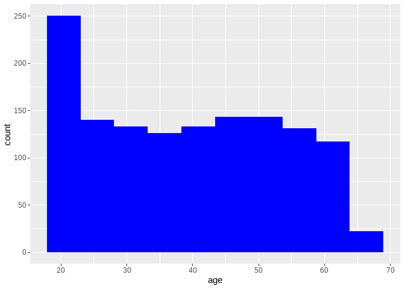
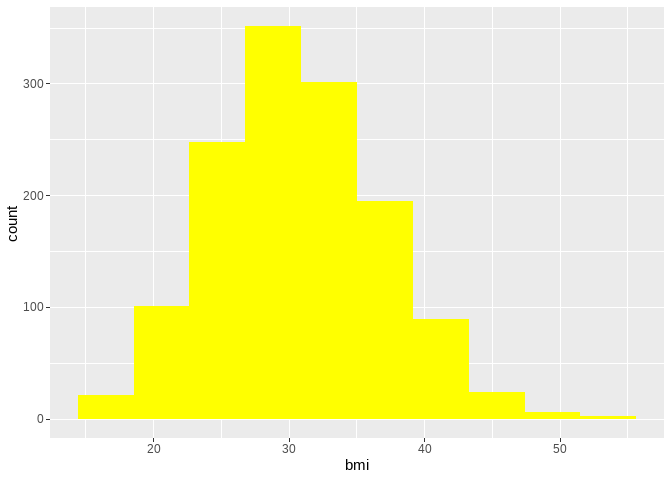
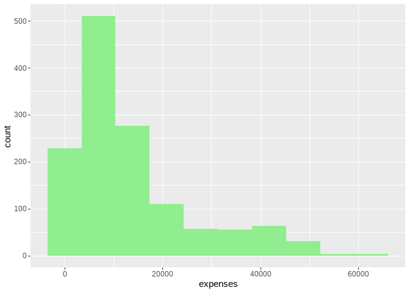
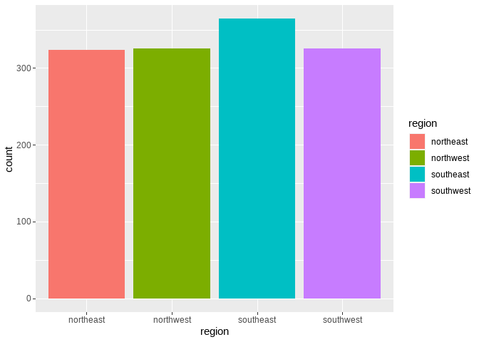
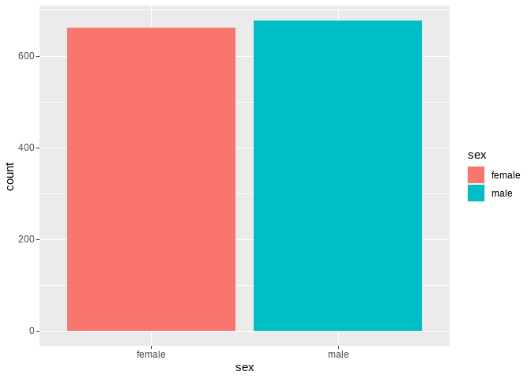

Insurance expenses prediction
================
francis kyalo
2023-01-18

``` r
# importing important libraries

library(tidyverse)
```

    ## Warning: package 'tidyverse' was built under R version 4.1.3

    ## -- Attaching packages --------------------------------------- tidyverse 1.3.1 --

    ## v ggplot2 3.3.5     v purrr   0.3.4
    ## v tibble  3.1.5     v dplyr   1.0.7
    ## v tidyr   1.1.4     v stringr 1.4.0
    ## v readr   2.1.2     v forcats 0.5.1

    ## Warning: package 'readr' was built under R version 4.1.3

    ## -- Conflicts ------------------------------------------ tidyverse_conflicts() --
    ## x dplyr::filter() masks stats::filter()
    ## x dplyr::lag()    masks stats::lag()

``` r
library(janitor)
```

    ## Warning: package 'janitor' was built under R version 4.1.3

    ## 
    ## Attaching package: 'janitor'

    ## The following objects are masked from 'package:stats':
    ## 
    ##     chisq.test, fisher.test

``` r
library(dlookr)
```

    ## Warning: package 'dlookr' was built under R version 4.1.3

    ## 
    ## Attaching package: 'dlookr'

    ## The following object is masked from 'package:tidyr':
    ## 
    ##     extract

    ## The following object is masked from 'package:base':
    ## 
    ##     transform

``` r
library(performance)
```

    ## Warning: package 'performance' was built under R version 4.1.3

``` r
df <- read_csv("~/R projects/insurance expenses ML/Insurances-expenses-Prediction-in-R/Insurancedata.csv")
```

    ## Rows: 1338 Columns: 7
    ## -- Column specification --------------------------------------------------------
    ## Delimiter: ","
    ## chr (3): sex, smoker, region
    ## dbl (4): age, bmi, children, expenses
    ## 
    ## i Use `spec()` to retrieve the full column specification for this data.
    ## i Specify the column types or set `show_col_types = FALSE` to quiet this message.

``` r
df %>% head()
```

    ## # A tibble: 6 x 7
    ##     age sex      bmi children smoker region    expenses
    ##   <dbl> <chr>  <dbl>    <dbl> <chr>  <chr>        <dbl>
    ## 1    19 female  27.9        0 yes    southwest   16885.
    ## 2    18 male    33.8        1 no     southeast    1726.
    ## 3    28 male    33          3 no     southeast    4449.
    ## 4    33 male    22.7        0 no     northwest   21984.
    ## 5    32 male    28.9        0 no     northwest    3867.
    ## 6    31 female  25.7        0 no     southeast    3757.

``` r
ggplot(df, aes(age))+
  geom_histogram(fill='blue', bins = 10)
```

<!-- -->

``` r
ggplot(df, aes(bmi))+
  geom_histogram(fill='yellow',bins = 10)
```

<!-- -->

``` r
ggplot(df, aes(expenses))+
  geom_histogram(fill='lightgreen', bins = 10)
```

<!-- -->

``` r
ggplot(df, aes(region, fill=region))+
  geom_bar()
```

<!-- -->

``` r
ggplot(df,aes(sex, fill=sex))+
  geom_bar()
```

<!-- -->

``` r
ggplot(df, aes(age, expenses, fill=smoker))+
  geom_point(color='grey')+
  geom_smooth()
```

    ## `geom_smooth()` using method = 'gam' and formula 'y ~ s(x, bs = "cs")'

<!-- -->

``` r
ggplot(df, aes(bmi, expenses, fill=smoker))+
  geom_point(color='grey')+
  geom_smooth(method = 'lm')
```

    ## `geom_smooth()` using formula 'y ~ x'

<!-- -->

``` r
df %>% group_by(smoker) %>% summarise(average_expenses = mean(expenses)) %>% 
  ggplot(aes(smoker, average_expenses, fill=smoker))+
    geom_bar(stat = 'identity')
```

<!-- -->

``` r
df %>% group_by(region) %>% summarise(average_expenses = mean(expenses)) %>% 
  ggplot(aes(region, average_expenses, fill=region))+
    geom_bar(stat = 'identity')
```

<!-- -->

``` r
ggplot(df, aes(children, expenses))+
  geom_point(color='red', alpha=0.7)
```

<!-- -->
