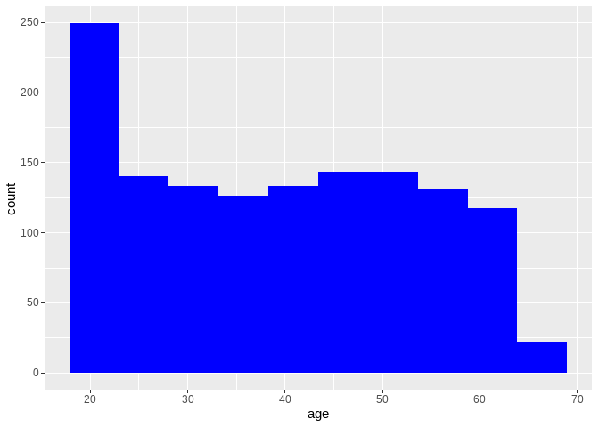

Insurance expenses prediction
================
francis kyalo
2023-01-18

\#INSURANCE EXPENSES PREDICTION

``` r
# importing important libraries

library(tidyverse)
```

    ## Warning: package 'tidyverse' was built under R version 4.1.3

    ## -- Attaching packages --------------------------------------- tidyverse 1.3.1 --

    ## v ggplot2 3.4.0     v purrr   0.3.4
    ## v tibble  3.1.5     v dplyr   1.0.7
    ## v tidyr   1.1.4     v stringr 1.4.0
    ## v readr   2.1.2     v forcats 0.5.1

    ## Warning: package 'ggplot2' was built under R version 4.1.3

    ## Warning: package 'readr' was built under R version 4.1.3

    ## -- Conflicts ------------------------------------------ tidyverse_conflicts() --
    ## x dplyr::filter() masks stats::filter()
    ## x dplyr::lag()    masks stats::lag()

``` r
library(janitor)
```

    ## Warning: package 'janitor' was built under R version 4.1.3

    ## 
    ## Attaching package: 'janitor'

    ## The following objects are masked from 'package:stats':
    ## 
    ##     chisq.test, fisher.test

``` r
library(dlookr)
```

    ## Warning: package 'dlookr' was built under R version 4.1.3

    ## 
    ## Attaching package: 'dlookr'

    ## The following object is masked from 'package:tidyr':
    ## 
    ##     extract

    ## The following object is masked from 'package:base':
    ## 
    ##     transform

``` r
library(performance)
```

    ## Warning: package 'performance' was built under R version 4.1.3

``` r
library(flextable)
```

    ## Warning: package 'flextable' was built under R version 4.1.3

    ## 
    ## Attaching package: 'flextable'

    ## The following object is masked from 'package:purrr':
    ## 
    ##     compose

``` r
library(MLmetrics)
```

    ## Warning: package 'MLmetrics' was built under R version 4.1.3

    ## 
    ## Attaching package: 'MLmetrics'

    ## The following object is masked from 'package:base':
    ## 
    ##     Recall

``` r
df <- read_csv("~/R projects/insurance expenses ML/Insurances-expenses-Prediction-in-R/Insurancedata.csv")
```

    ## Rows: 1338 Columns: 7
    ## -- Column specification --------------------------------------------------------
    ## Delimiter: ","
    ## chr (3): sex, smoker, region
    ## dbl (4): age, bmi, children, expenses
    ## 
    ## i Use `spec()` to retrieve the full column specification for this data.
    ## i Specify the column types or set `show_col_types = FALSE` to quiet this message.

# EXPLORATORY DATA ANALYSIS AND DATA CLEANING

``` r
# check for any missing values 
df %>% duplicated() %>% sum()
```

    ## [1] 1

``` r
# removing the duplicated row 
df <- df %>% distinct()
```

``` r
# getting a feel of the data and check if they are any missing values

df %>% describe()
```

    ## # A tibble: 4 x 26
    ##   described_variables     n    na   mean     sd se_mean    IQR skewness kurtosis
    ##   <chr>               <int> <int>  <dbl>  <dbl>   <dbl>  <dbl>    <dbl>    <dbl>
    ## 1 age                  1337     0 3.92e1 1.40e1 3.84e-1 2.4 e1   0.0548  -1.24  
    ## 2 bmi                  1337     0 3.07e1 6.10e0 1.67e-1 8.4 e0   0.284   -0.0556
    ## 3 children             1337     0 1.10e0 1.21e0 3.30e-2 2   e0   0.937    0.201 
    ## 4 expenses             1337     0 1.33e4 1.21e4 3.31e+2 1.19e4   1.52     1.60  
    ## # ... with 17 more variables: p00 <dbl>, p01 <dbl>, p05 <dbl>, p10 <dbl>,
    ## #   p20 <dbl>, p25 <dbl>, p30 <dbl>, p40 <dbl>, p50 <dbl>, p60 <dbl>,
    ## #   p70 <dbl>, p75 <dbl>, p80 <dbl>, p90 <dbl>, p95 <dbl>, p99 <dbl>,
    ## #   p100 <dbl>

``` r
df %>% diagnose_category()
```

    ## # A tibble: 8 x 6
    ##   variables levels        N  freq ratio  rank
    ##   <chr>     <chr>     <int> <int> <dbl> <int>
    ## 1 sex       male       1337   675  50.5     1
    ## 2 sex       female     1337   662  49.5     2
    ## 3 smoker    no         1337  1063  79.5     1
    ## 4 smoker    yes        1337   274  20.5     2
    ## 5 region    southeast  1337   364  27.2     1
    ## 6 region    southwest  1337   325  24.3     2
    ## 7 region    northeast  1337   324  24.2     3
    ## 8 region    northwest  1337   324  24.2     3

``` r
df %>% diagnose_numeric()
```

    ## # A tibble: 4 x 10
    ##   variables   min     Q1     mean median      Q3     max  zero minus outlier
    ##   <chr>     <dbl>  <dbl>    <dbl>  <dbl>   <dbl>   <dbl> <int> <int>   <int>
    ## 1 age         18    27      39.2    39      51      64       0     0       0
    ## 2 bmi         16    26.3    30.7    30.4    34.7    53.1     0     0       9
    ## 3 children     0     0       1.10    1       2       5     573     0       0
    ## 4 expenses  1122. 4746.  13279.   9386.  16658.  63770.      0     0     139

``` r
# check for outliers in our dataset
df %>% diagnose_outlier()
```

    ## # A tibble: 4 x 6
    ##   variables outliers_cnt outliers_ratio outliers_mean with_mean without_mean
    ##   <chr>            <int>          <dbl>         <dbl>     <dbl>        <dbl>
    ## 1 age                  0          0             NaN       39.2         39.2 
    ## 2 bmi                  9          0.673          49.3     30.7         30.5 
    ## 3 children             0          0             NaN        1.10         1.10
    ## 4 expenses           139         10.4         42104.   13279.        9935.

Although there is evidence of outliers, they don’t seem to have such a
great effect on the mean so they will be no need to remove them unless
they affect our regression model

``` r
df %>% head()
```

    ## # A tibble: 6 x 7
    ##     age sex      bmi children smoker region    expenses
    ##   <dbl> <chr>  <dbl>    <dbl> <chr>  <chr>        <dbl>
    ## 1    19 female  27.9        0 yes    southwest   16885.
    ## 2    18 male    33.8        1 no     southeast    1726.
    ## 3    28 male    33          3 no     southeast    4449.
    ## 4    33 male    22.7        0 no     northwest   21984.
    ## 5    32 male    28.9        0 no     northwest    3867.
    ## 6    31 female  25.7        0 no     southeast    3757.

``` r
ggplot(df, aes(age))+
  geom_histogram(fill='blue', bins = 10)
```

<!-- -->

``` r
ggplot(df, aes(bmi))+
  geom_histogram(fill='yellow',bins = 10)
```

<!-- -->

``` r
ggplot(df, aes(expenses))+
  geom_histogram(fill='lightgreen', bins = 10)
```

<!-- -->

``` r
ggplot(df, aes(region, fill=region))+
  geom_bar()
```

<!-- -->

``` r
ggplot(df,aes(sex, fill=sex))+
  geom_bar()
```

<!-- -->

``` r
ggplot(df, aes(age, expenses, fill=smoker))+
  geom_point(color='grey')+
  geom_smooth()
```

    ## `geom_smooth()` using method = 'gam' and formula = 'y ~ s(x, bs = "cs")'

<!-- -->

``` r
ggplot(df, aes(bmi, expenses, fill=smoker))+
  geom_point(color='grey')+
  geom_smooth(method = 'lm')
```

    ## `geom_smooth()` using formula = 'y ~ x'

<!-- -->

``` r
df %>% group_by(smoker) %>% summarise(average_expenses = mean(expenses)) %>% 
  ggplot(aes(smoker, average_expenses, fill=smoker))+
    geom_bar(stat = 'identity')
```

<!-- -->

``` r
df %>% group_by(region) %>% summarise(average_expenses = mean(expenses)) %>% 
  ggplot(aes(region, average_expenses, fill=region))+
    geom_bar(stat = 'identity')
```

<!-- -->

``` r
ggplot(df, aes(children, expenses))+
  geom_point(color='red', alpha=0.7)
```

<!-- -->

``` r
# checking collinearity

df %>% correlate() %>% flextable()
```

    ## PhantomJS not found. You can install it with webshot::install_phantomjs(). If it is installed, please make sure the phantomjs executable can be found via the PATH variable.

# MODELLING🤯

### First Model

``` r
first_model <- lm(expenses ~., data = df)
first_model %>% summary()
```

    ## 
    ## Call:
    ## lm(formula = expenses ~ ., data = df)
    ## 
    ## Residuals:
    ##      Min       1Q   Median       3Q      Max 
    ## -11302.9  -2851.0   -975.2   1381.5  29981.8 
    ## 
    ## Coefficients:
    ##                  Estimate Std. Error t value Pr(>|t|)    
    ## (Intercept)     -11939.58     988.22 -12.082  < 2e-16 ***
    ## age                256.75      11.91  21.554  < 2e-16 ***
    ## sexmale           -129.51     333.18  -0.389 0.697548    
    ## bmi                339.35      28.61  11.861  < 2e-16 ***
    ## children           475.01     137.89   3.445 0.000589 ***
    ## smokeryes        23846.27     413.33  57.693  < 2e-16 ***
    ## regionnorthwest   -349.04     476.81  -0.732 0.464274    
    ## regionsoutheast  -1035.84     478.86  -2.163 0.030707 *  
    ## regionsouthwest   -959.34     478.08  -2.007 0.044992 *  
    ## ---
    ## Signif. codes:  0 '***' 0.001 '**' 0.01 '*' 0.05 '.' 0.1 ' ' 1
    ## 
    ## Residual standard error: 6064 on 1328 degrees of freedom
    ## Multiple R-squared:  0.7508, Adjusted R-squared:  0.7493 
    ## F-statistic:   500 on 8 and 1328 DF,  p-value: < 2.2e-16

### Model diagnostics

``` r
first_model %>% check_heteroscedasticity() %>% plot()
```

<!-- -->

``` r
# checking for normality of residuals
first_model %>% check_normality() %>% plot()
```

<!-- -->

``` r
first_model %>% check_collinearity()
```

    ## # Check for Multicollinearity
    ## 
    ## Low Correlation
    ## 
    ##      Term  VIF      VIF 95% CI Increased SE Tolerance Tolerance 95% CI
    ##       age 1.02 [1.00,    1.44]         1.01      0.98     [0.69, 1.00]
    ##       sex 1.01 [1.00,    4.79]         1.00      0.99     [0.21, 1.00]
    ##       bmi 1.11 [1.06,    1.20]         1.05      0.90     [0.84, 0.94]
    ##  children 1.00 [1.00, 2511.40]         1.00      1.00     [0.00, 1.00]
    ##    smoker 1.01 [1.00,    2.09]         1.01      0.99     [0.48, 1.00]
    ##    region 1.10 [1.05,    1.19]         1.05      0.91     [0.84, 0.95]

``` r
first_model %>% check_outliers() %>% plot()
```

<!-- -->

``` r
# Accuracy of the model 
MAPE(y_pred = first_model$fitted.values, y_true = df$expenses)
```

    ## [1] 0.4203018

## Second Model🎅

In this model we will log transform the target and include interaction
terms between age and smoker and BMI and smoker

``` r
df2 <- df %>% mutate(log_exp = log(expenses)) %>% select(-expenses)

df2 %>% head()
```

    ## # A tibble: 6 x 7
    ##     age sex      bmi children smoker region    log_exp
    ##   <dbl> <chr>  <dbl>    <dbl> <chr>  <chr>       <dbl>
    ## 1    19 female  27.9        0 yes    southwest    9.73
    ## 2    18 male    33.8        1 no     southeast    7.45
    ## 3    28 male    33          3 no     southeast    8.40
    ## 4    33 male    22.7        0 no     northwest   10.0 
    ## 5    32 male    28.9        0 no     northwest    8.26
    ## 6    31 female  25.7        0 no     southeast    8.23

``` r
second_model <- lm(log_exp ~ age + sex + bmi + 
                     children +
                     smoker + 
                     region +
                     age * smoker +
                     bmi * smoker, data = df2)

second_model %>% summary()
```

    ## 
    ## Call:
    ## lm(formula = log_exp ~ age + sex + bmi + children + smoker + 
    ##     region + age * smoker + bmi * smoker, data = df2)
    ## 
    ## Residuals:
    ##      Min       1Q   Median       3Q      Max 
    ## -0.65572 -0.15316 -0.06361 -0.01160  2.34837 
    ## 
    ## Coefficients:
    ##                   Estimate Std. Error t value Pr(>|t|)    
    ## (Intercept)      7.1337582  0.0699609 101.968  < 2e-16 ***
    ## age              0.0415349  0.0008504  48.839  < 2e-16 ***
    ## sexmale         -0.0849524  0.0212492  -3.998 6.74e-05 ***
    ## bmi              0.0011613  0.0020446   0.568   0.5701    
    ## children         0.1060987  0.0087857  12.076  < 2e-16 ***
    ## smokeryes        1.2778459  0.1458646   8.760  < 2e-16 ***
    ## regionnorthwest -0.0636347  0.0303794  -2.095   0.0364 *  
    ## regionsoutheast -0.1449052  0.0305214  -4.748 2.28e-06 ***
    ## regionsouthwest -0.1508405  0.0304709  -4.950 8.36e-07 ***
    ## age:smokeryes   -0.0333667  0.0018876 -17.676  < 2e-16 ***
    ## bmi:smokeryes    0.0510193  0.0042061  12.130  < 2e-16 ***
    ## ---
    ## Signif. codes:  0 '***' 0.001 '**' 0.01 '*' 0.05 '.' 0.1 ' ' 1
    ## 
    ## Residual standard error: 0.3863 on 1326 degrees of freedom
    ## Multiple R-squared:  0.8246, Adjusted R-squared:  0.8232 
    ## F-statistic: 623.2 on 10 and 1326 DF,  p-value: < 2.2e-16

``` r
MAPE(y_pred = second_model$fitted.values, y_true = df2$log_exp)
```

    ## [1] 0.0228614

``` r
exp(0.0228614)
```

    ## [1] 1.023125

This shows that the second model is better than the first model as it
has more superior R-squared and Mean Absolute Percentage Error🚀

# Hurray we did it 🏆
